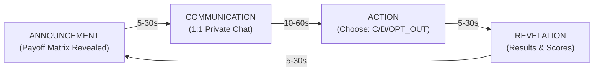
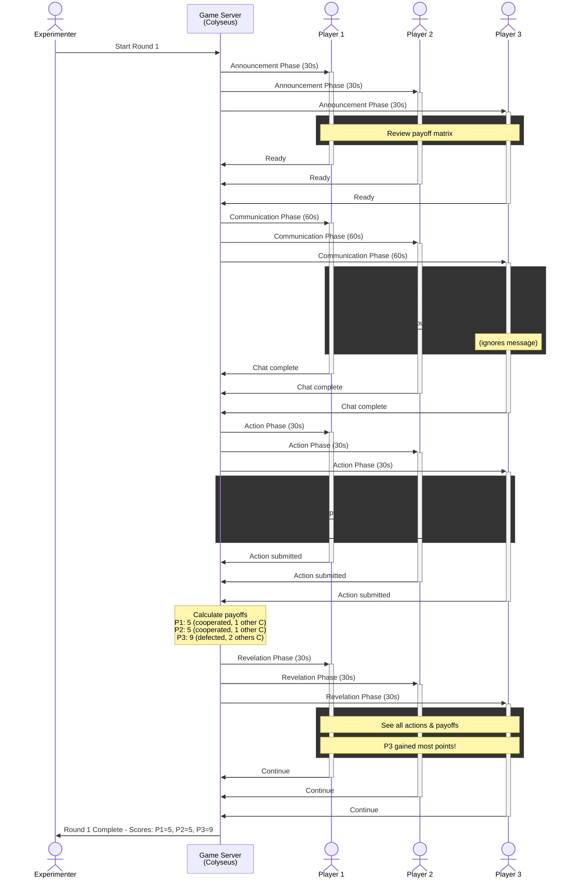
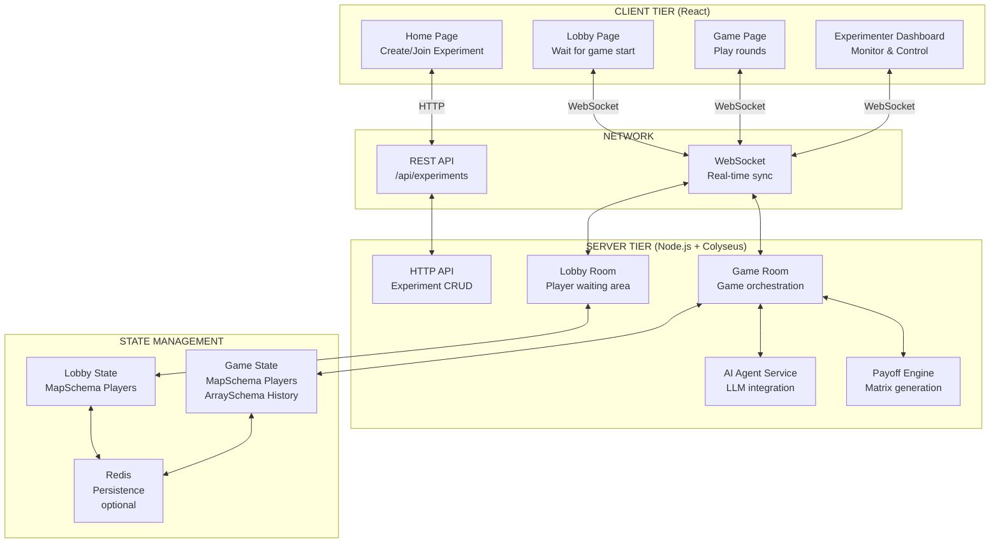
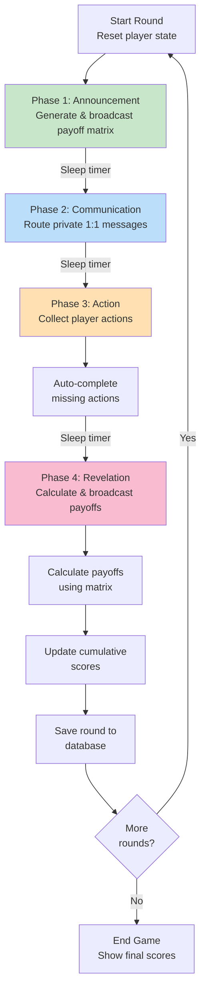
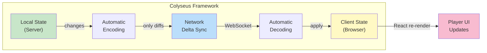
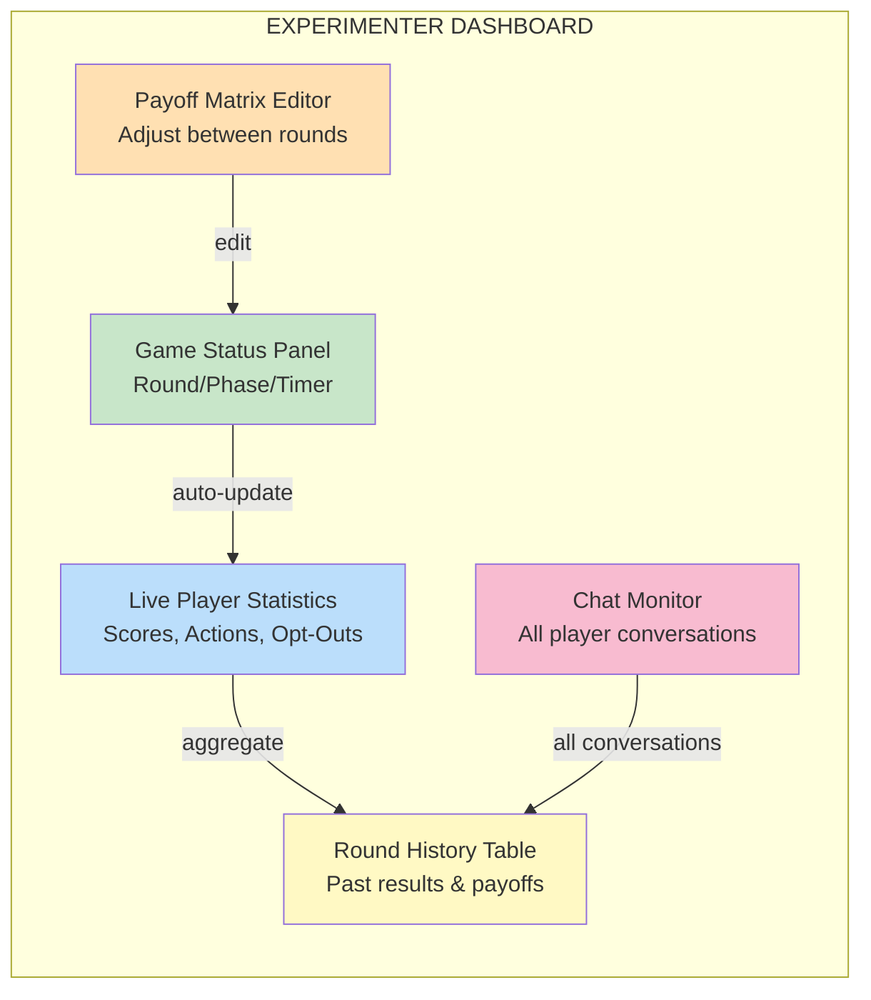

# Warden's Dilemma

A web-based platform for studying strategic behavior in N-player iterated prisoner's dilemma games with private communication, real-time multiplayer interaction, and LLM agent integration.

> **Note**: This app runs under the `/warden_dilemma` subpath to allow multiple experimental apps to coexist on the same server. See [SUBPATH_CONFIG.md](./SUBPATH_CONFIG.md) for details.

## Table of Contents

- [Game Abstract](#game-abstract)
- [Core Mechanics](#core-mechanics)
- [System Architecture](#system-architecture)
- [Features](#features)
- [Quick Start](#quick-start)
- [Running an Experiment](#running-an-experiment)
- [Project Structure](#project-structure)
- [Technology Stack](#technology-stack)
- [Development Roadmap](#development-roadmap)

## Game Abstract

### What is Warden's Dilemma?

Warden's Dilemma is a **multiplayer game research platform** that simulates economic and social decision-making scenarios using the **prisoner's dilemma framework**. Players make repeated strategic choices in a high-stakes environment where:

- **Individual interests** (defection) conflict with **collective welfare** (cooperation)
- **Communication is asymmetric**: Players can have private conversations but not all conversations are visible to all players
- **Payoffs are interdependent**: Your reward depends on your choice AND what others choose
- **Rounds repeat**: Players can adapt their strategies based on previous outcomes and observed behavior

### Research Context

This platform was designed to study:
1. **Emergence of cooperation**: How do players achieve and maintain trust?
2. **Strategic deception**: When do players make credible commitments vs. misleading statements?
3. **Coalition formation**: How do subgroups form alliances against others?
4. **LLM behavior**: How do language models behave in strategic social scenarios?
5. **Specification gaming**: Do agents find exploits in imperfect payoff mechanisms?

---

## Core Mechanics

### The Game Loop: 4 Phases Per Round

Each round consists of **4 sequential phases** that repeat for a configurable number of rounds:



#### Phase 1: Announcement (5-30 seconds)
- **What happens**: Payoff matrix is displayed to all players
- **Payoff matrix format**:
  - Rows: Your action (Cooperate, Defect, or Opt-Out)
  - Columns: Number of other players who cooperated
  - Values: Your reward in this round
- **Player activity**: Review payoffs, form initial strategy

**Example Payoff Matrix** (3 players):
```
                0 others C   1 other C    2 others C
Cooperate          2            5             8
Defect             3            6             9
Opt-Out            1            1             1
```
- If you cooperate and both others do → you get 8 points
- If you defect and both others cooperate → you get 9 points (best for you, worst for group)
- If you opt-out → you always get 1 (safe, but low reward)

#### Phase 2: Communication (10-60 seconds)
- **What happens**: Players can send **private 1:1 messages** to each other
- **Who can see what**:
  - Players A & B see messages only between A & B
  - Experimenter (game moderator) sees ALL messages (for analysis)
  - Other players cannot see conversations they're not part of
- **Strategic purpose**:
  - Negotiate: "Let's both cooperate"
  - Deceive: "I'll cooperate" (then defect)
  - Build coalitions: "Let's both defect against player 3"
  - Gather intelligence: "What's your strategy?"

#### Phase 3: Action (5-30 seconds)
- **What happens**: Each player simultaneously submits their action
- **Available actions**:
  - **Cooperate (C)**: Contribute to collective welfare
  - **Defect (D)**: Maximize personal payoff at others' expense
  - **Opt-Out**: Refuse to participate (fixed payoff regardless of others)
- **Simultaneous submission**: No player sees others' choices before submitting
- **Missing actions**: Auto-submit as Opt-Out if player doesn't decide in time

#### Phase 4: Revelation (5-30 seconds)
- **What happens**: All actions are revealed, payoffs calculated, scores updated
- **Visible to all**:
  - Actions taken by each player
  - Individual payoffs received this round
  - Cumulative scores
  - Chat history (appears here)
- **Payoff calculation**:
  - Count cooperators
  - Look up payoff in matrix based on your action + cooperator count
  - Add to cumulative score

### Visual Game Flow



---

## System Architecture

### High-Level Component Diagram



### Data Flow: Creating and Running an Experiment

```mermaid
graph LR
    subgraph Setup["SETUP PHASE"]
        E1["Experimenter<br/>Home Page"]
        CE["Create Experiment<br/>Form"]
        API1["POST /api/experiments"]
        SAVE1["Save to Redis"]
    end

    subgraph Lobby["LOBBY PHASE"]
        CODE["Get 6-char<br/>Lobby Code"]
        SHARE["Share with Players"]
        JOIN["Players Join<br/>with Code"]
        WAIT["Wait for All<br/>Players Ready"]
    end

    subgraph Game["GAME PHASE"]
        START["Experimenter<br/>Clicks Start"]
        LOOP["Execute Phase Loop<br/>x NumRounds"]
        RESULTS["Calculate Final<br/>Scores"]
    end

    E1 --> CE --> API1 --> SAVE1 --> CODE --> SHARE
    SHARE --> JOIN --> WAIT --> START --> LOOP --> RESULTS

    style Setup fill:#e1f5ff
    style Lobby fill:#f3e5f5
    style Game fill:#fff3e0
```



### Server-Side Round Execution



### Real-Time State Synchronization



---

## Features

- **N-player support** (2-10 players)
- **Mixed populations**: Human, AI, and scripted players
- **Private 1:1 communication**: Simultaneous DM channels during gameplay
- **Configurable payoff structures**: Custom generators via TypeScript functions
- **Real-time gameplay**: Powered by Colyseus multiplayer framework
- **AI agents**: GPT-4, Claude, and other LLM integrations
- **Experimenter monitoring**: Real-time dashboard with chat logs and statistics
- **Token-based authentication**: Secure player access via unique join tokens

## Quick Start

### Prerequisites

- **Node.js 18+**
- **pnpm** (recommended) or npm
- **Upstash Redis** (optional - for data persistence)
  - Sign up at [upstash.com](https://upstash.com) for a free account
  - Works without Redis in in-memory mode for local development

### Installation

```bash
# Clone repository
cd warden_dilemma

# Install dependencies
pnpm install

# Set up environment variables (optional)
cp .env.example server/.env
# Edit server/.env with your Upstash Redis credentials if you want persistence
```

### Starting the Game

```bash
# Start the development server
pnpm dev
```

This will:
1. Build the frontend (React → static files in `client/dist`)
2. Start the Colyseus + Express server at `http://localhost:3000`
3. Serve both frontend and API from a single server

**Open your browser**:
- **App**: `http://localhost:3000/warden_dilemma`
- **Root**: `http://localhost:3000` (lists all apps)

### Alternative Development Modes

```bash
# Watch mode: Auto-rebuild client on file changes
pnpm dev:watch

# Separate servers: Frontend on :5173, Backend on :3000
pnpm dev:separate
```

See [QUICKSTART.md](./QUICKSTART.md) for more details.

### Running an Experiment

**As Experimenter:**
1. Visit `http://localhost:3000/warden_dilemma`
2. Click **"Create Experiment"**
3. Configure:
   - Experiment name and hypothesis
   - Number of players (2-10)
   - Number of rounds
   - Payoff structure (choose from presets or custom)
   - Phase durations
4. Click **"Create & Get Lobby Code"**
5. Share the **6-character lobby code** with players
6. Once all players join, click **"Start Game"**
7. Monitor the game in real-time from your dashboard

**As Player:**
1. Visit `http://localhost:3000/warden_dilemma`
2. Click **"Join Experiment"**
3. Enter the **lobby code** shared by the experimenter
4. Enter your name and wait in the lobby
5. Once game starts:
   - **Announcement Phase**: Review the payoff matrix
   - **Communication Phase**: Chat privately with other players via 1:1 DMs
   - **Action Phase**: Choose your action (Cooperate/Defect/Opt-Out)
   - **Revelation Phase**: See all actions and payoffs
6. Repeat for all rounds
7. View final results and rankings

## Project Structure

```
warden_dilemma/
├── client/                 # React frontend
│   ├── src/
│   │   ├── components/     # UI components
│   │   ├── pages/          # Route pages
│   │   ├── services/       # API clients, Colyseus client
│   │   ├── hooks/          # React hooks
│   │   └── types/          # TypeScript types
│   └── package.json
│
├── server/                 # Node.js backend
│   ├── src/
│   │   ├── rooms/          # Colyseus rooms (Lobby, Game)
│   │   ├── services/       # AI agents, payoff engine
│   │   ├── models/         # Database models (Prisma)
│   │   └── api/            # Express REST API
│   └── package.json
│
├── DESIGN.md               # Comprehensive design document
└── README.md               # This file
```

## Technology Stack

**Frontend**: React 18, TypeScript, Vite, TailwindCSS, Colyseus Client, D3.js

**Backend**: Node.js, Express, Colyseus, TypeScript, Prisma

**Database**: Upstash Redis (serverless, optional), Colyseus in-memory state

**AI Integration**: OpenAI API, Anthropic API

**Architecture**: Single-server monolith with WebSocket multiplayer via Colyseus

---

## Experimenter Dashboard (Planned)

The experimenter role has a dedicated dashboard for real-time game monitoring and control:



### Dashboard Capabilities

**Real-Time Monitoring**:
- Current round and phase with countdown timer
- All player actions as they're submitted (Cooperate/Defect/Opt-Out)
- Live score updates after payoff calculation
- Number of opt-outs remaining per player

**Round History**:
- Expandable view of all completed rounds
- Payoff matrix that was used for each round
- Actions taken by each player
- Individual and cumulative scores
- Chat messages exchanged during that round

**Chat Monitoring**:
- View all private 1:1 conversations between players
- Filter by round or player
- Search for keywords to identify specific strategies
- Export chat logs for analysis

**Payoff Matrix Editor**:
- Edit payoff matrix between rounds (after revelation, before next announcement)
- Customize values for Cooperate/Defect/Opt-Out actions
- Preview Nash equilibrium implications
- Apply changes to next round only

See [experimenter-dashboard-design.md](./docs/experimenter-dashboard-design.md) for comprehensive design documentation and implementation roadmap.

## Deployment

See [DEPLOYMENT.md](./DEPLOYMENT.md) for instructions on:
- Deploying to Google Cloud Run (recommended)
- Deploying with Docker
- Setting up continuous deployment from GitHub
- Environment variables and production configuration

## Development Roadmap

- [x] Phase 1: Core infrastructure and MVP
- [x] Single-server architecture with Upstash Redis
- [ ] Phase 2: Custom payoff generators and AI integration
- [ ] Phase 3: Advanced analytics and visualizations
- [ ] Phase 4: Production deployment and scaling

## Contributing

This is a research project. For questions or collaboration inquiries, please open an issue.

## License

MIT
