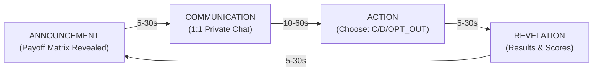
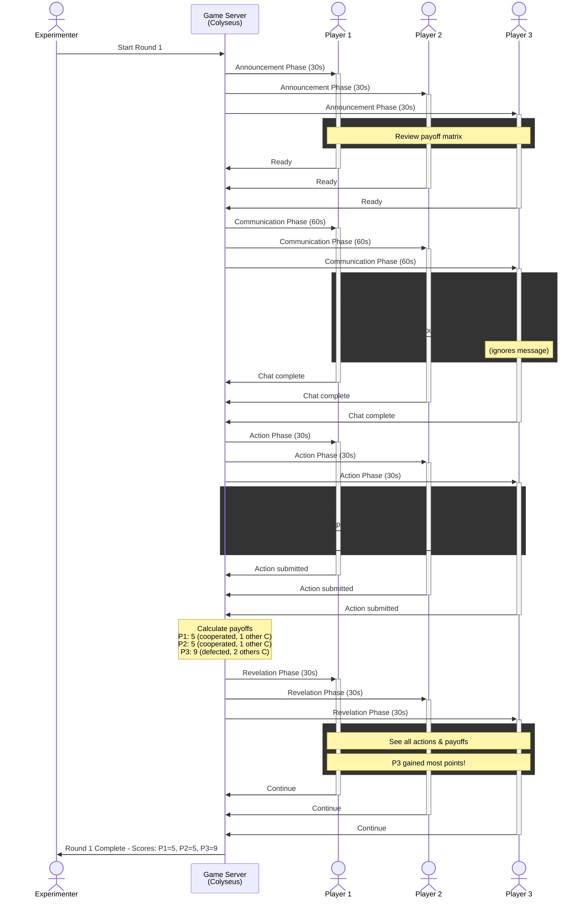
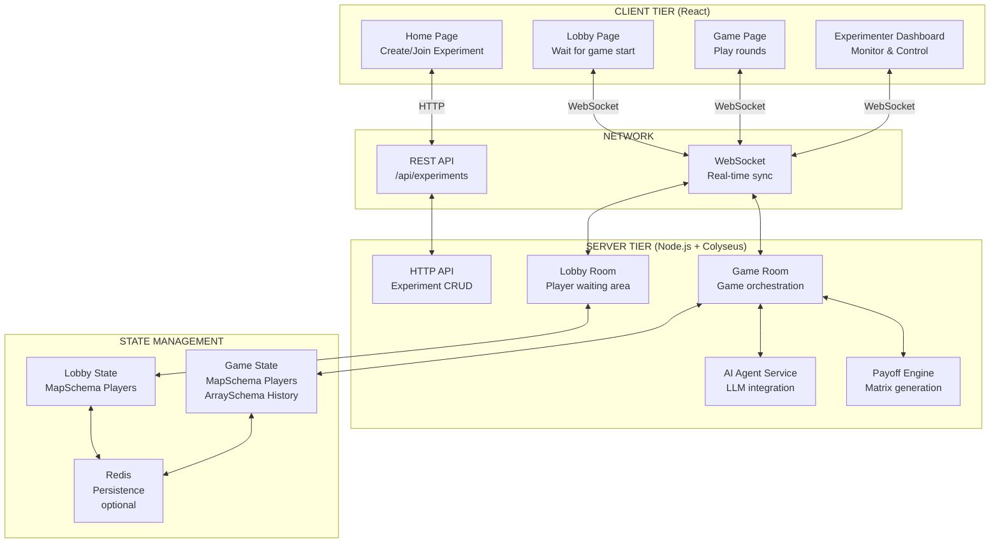
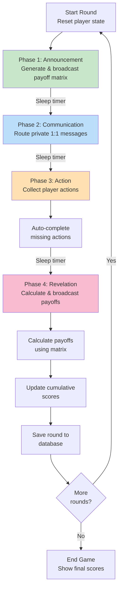
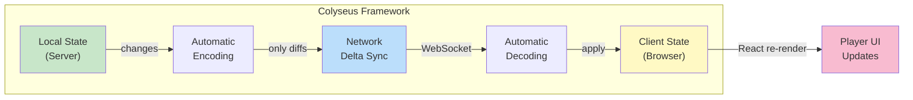
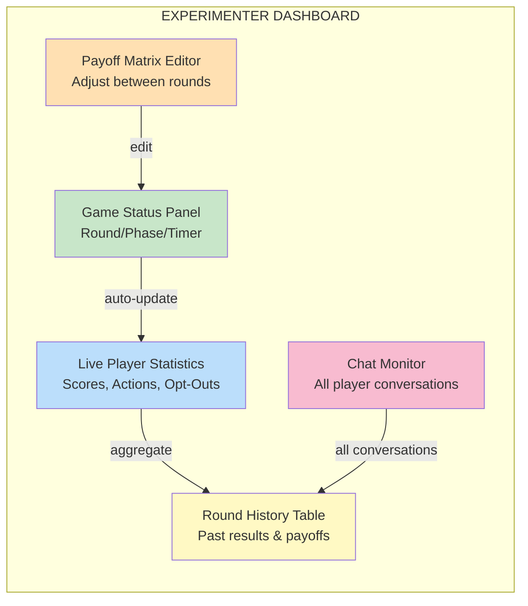

# Warden's Dilemma

A web-based platform for studying strategic behavior in N-player iterated prisoner's dilemma games with private communication, real-time multiplayer interaction, and LLM agent integration.

> **Note**: This app runs under the `/warden_dilemma` subpath to allow multiple experimental apps to coexist on the same server. See [SUBPATH_CONFIG.md](./SUBPATH_CONFIG.md) for details.

## Table of Contents

- [Game Abstract](#game-abstract)
- [Core Mechanics](#core-mechanics)
- [System Architecture](#system-architecture)
- [Features](#features)
- [Quick Start](#quick-start)
- [Running an Experiment](#running-an-experiment)
- [Project Structure](#project-structure)
- [Technology Stack](#technology-stack)
- [Development Roadmap](#development-roadmap)

## Game Abstract

### What is Warden's Dilemma?

Warden's Dilemma is a **multiplayer game research platform** that simulates economic and social decision-making scenarios using the **prisoner's dilemma framework**. Players make repeated strategic choices in a high-stakes environment where:

- **Individual interests** (defection) conflict with **collective welfare** (cooperation)
- **Communication is asymmetric**: Players can have private conversations but not all conversations are visible to all players
- **Payoffs are interdependent**: Your reward depends on your choice AND what others choose
- **Rounds repeat**: Players can adapt their strategies based on previous outcomes and observed behavior

### Research Context

This platform was designed to study:
1. **Emergence of cooperation**: How do players achieve and maintain trust?
2. **Strategic deception**: When do players make credible commitments vs. misleading statements?
3. **Coalition formation**: How do subgroups form alliances against others?
4. **LLM behavior**: How do language models behave in strategic social scenarios?
5. **Specification gaming**: Do agents find exploits in imperfect payoff mechanisms?

---

## Core Mechanics

### The Game Loop: 4 Phases Per Round

Each round consists of **4 sequential phases** that repeat for a configurable number of rounds:



#### Phase 1: Announcement (5-30 seconds)
- **What happens**: Payoff matrix is displayed to all players
- **Payoff matrix format**:
  - Rows: Your action (Cooperate, Defect, or Opt-Out)
  - Columns: Number of other players who cooperated
  - Values: Your reward in this round
- **Player activity**: Review payoffs, form initial strategy

**Example Payoff Matrix** (3 players):
```
                0 others C   1 other C    2 others C
Cooperate          2            5             8
Defect             3            6             9
Opt-Out            1            1             1
```
- If you cooperate and both others do → you get 8 points
- If you defect and both others cooperate → you get 9 points (best for you, worst for group)
- If you opt-out → you always get 1 (safe, but low reward)

#### Phase 2: Communication (10-60 seconds)
- **What happens**: Players can send **private 1:1 messages** to each other
- **Who can see what**:
  - Players A & B see messages only between A & B
  - Experimenter (game moderator) sees ALL messages (for analysis)
  - Other players cannot see conversations they're not part of
- **Strategic purpose**:
  - Negotiate: "Let's both cooperate"
  - Deceive: "I'll cooperate" (then defect)
  - Build coalitions: "Let's both defect against player 3"
  - Gather intelligence: "What's your strategy?"

#### Phase 3: Action (5-30 seconds)
- **What happens**: Each player simultaneously submits their action
- **Available actions**:
  - **Cooperate (C)**: Contribute to collective welfare
  - **Defect (D)**: Maximize personal payoff at others' expense
  - **Opt-Out**: Refuse to participate (fixed payoff regardless of others)
- **Simultaneous submission**: No player sees others' choices before submitting
- **Missing actions**: Auto-submit as Opt-Out if player doesn't decide in time

#### Phase 4: Revelation (5-30 seconds)
- **What happens**: All actions are revealed, payoffs calculated, scores updated
- **Visible to all**:
  - Actions taken by each player
  - Individual payoffs received this round
  - Cumulative scores
  - Chat history (appears here)
- **Payoff calculation**:
  - Count cooperators
  - Look up payoff in matrix based on your action + cooperator count
  - Add to cumulative score

### Visual Game Flow



---

## System Architecture

### High-Level Component Diagram



### Data Flow: Creating and Running an Experiment

```mermaid
graph LR
    subgraph Setup["SETUP PHASE"]
        E1["Experimenter<br/>Home Page"]
        CE["Create Experiment<br/>Form"]
        API1["POST /api/experiments"]
        SAVE1["Save to Redis"]
    end

    subgraph Lobby["LOBBY PHASE"]
        CODE["Get 6-char<br/>Lobby Code"]
        SHARE["Share with Players"]
        JOIN["Players Join<br/>with Code"]
        WAIT["Wait for All<br/>Players Ready"]
    end

    subgraph Game["GAME PHASE"]
        START["Experimenter<br/>Clicks Start"]
        LOOP["Execute Phase Loop<br/>x NumRounds"]
        RESULTS["Calculate Final<br/>Scores"]
    end

    E1 --> CE --> API1 --> SAVE1 --> CODE --> SHARE
    SHARE --> JOIN --> WAIT --> START --> LOOP --> RESULTS

    style Setup fill:#e1f5ff
    style Lobby fill:#f3e5f5
    style Game fill:#fff3e0
```



### Server-Side Round Execution



### Real-Time State Synchronization



---

## Features

- **N-player support** (2-10 players)
- **Mixed populations**: Human, AI, and scripted players
- **Private 1:1 communication**: Simultaneous DM channels during gameplay
- **Configurable payoff structures**: Custom generators via TypeScript functions
- **Real-time gameplay**: Powered by Colyseus multiplayer framework
- **AI agents**: GPT-4, Claude, and other LLM integrations
- **Experimenter monitoring**: Real-time dashboard with chat logs and statistics
- **Token-based authentication**: Secure player access via unique join tokens

## Quick Start

### Prerequisites

- **Node.js 18+**
- **pnpm** (recommended) or npm
- **Upstash Redis** (optional - for data persistence)
  - Sign up at [upstash.com](https://upstash.com) for a free account
  - Works without Redis in in-memory mode for local development

### Installation

```bash
# Clone repository
cd warden_dilemma

# Install dependencies
pnpm install

# Set up environment variables (optional)
cp .env.example server/.env
# Edit server/.env with your Upstash Redis credentials if you want persistence
```

### Starting the Game

```bash
# Start the development server
pnpm dev
```

This will:
1. Build the frontend (React → static files in `client/dist`)
2. Start the Colyseus + Express server at `http://localhost:3000`
3. Serve both frontend and API from a single server

**Open your browser**:
- **App**: `http://localhost:3000/warden_dilemma`
- **Root**: `http://localhost:3000` (lists all apps)

### Alternative Development Modes

```bash
# Watch mode: Auto-rebuild client on file changes
pnpm dev:watch

# Separate servers: Frontend on :5173, Backend on :3000
pnpm dev:separate
```

See [QUICKSTART.md](./QUICKSTART.md) for more details.

### Running an Experiment

**As Experimenter:**
1. Visit `http://localhost:3000/warden_dilemma`
2. Click **"Create Experiment"**
3. Configure:
   - Experiment name and hypothesis
   - Number of players (2-10)
   - Number of rounds
   - Payoff structure (choose from presets or custom)
   - Phase durations
4. Click **"Create & Get Lobby Code"**
5. Share the **6-character lobby code** with players
6. Once all players join, click **"Start Game"**
7. Monitor the game in real-time from your dashboard

**As Player:**
1. Visit `http://localhost:3000/warden_dilemma`
2. Click **"Join Experiment"**
3. Enter the **lobby code** shared by the experimenter
4. Enter your name and wait in the lobby
5. Once game starts:
   - **Announcement Phase**: Review the payoff matrix
   - **Communication Phase**: Chat privately with other players via 1:1 DMs
   - **Action Phase**: Choose your action (Cooperate/Defect/Opt-Out)
   - **Revelation Phase**: See all actions and payoffs
6. Repeat for all rounds
7. View final results and rankings

## Project Structure

```
warden_dilemma/
├── client/                 # React frontend
│   ├── src/
│   │   ├── components/     # UI components
│   │   ├── pages/          # Route pages
│   │   ├── services/       # API clients, Colyseus client
│   │   ├── hooks/          # React hooks
│   │   └── types/          # TypeScript types
│   └── package.json
│
├── server/                 # Node.js backend
│   ├── src/
│   │   ├── rooms/          # Colyseus rooms (Lobby, Game)
│   │   ├── services/       # AI agents, payoff engine
│   │   ├── models/         # Database models (Prisma)
│   │   └── api/            # Express REST API
│   └── package.json
│
├── DESIGN.md               # Comprehensive design document
└── README.md               # This file
```

## Technology Stack

**Frontend**: React 18, TypeScript, Vite, TailwindCSS, Colyseus Client, D3.js

**Backend**: Node.js, Express, Colyseus, TypeScript, Prisma

**Database**: Upstash Redis (serverless, optional), Colyseus in-memory state

**AI Integration**: OpenAI API, Anthropic API

**Architecture**: Single-server monolith with WebSocket multiplayer via Colyseus

---

## Experimenter Dashboard (Planned)

The experimenter role has a dedicated dashboard for real-time game monitoring and control:



### Dashboard Capabilities

**Real-Time Monitoring**:
- Current round and phase with countdown timer
- All player actions as they're submitted (Cooperate/Defect/Opt-Out)
- Live score updates after payoff calculation
- Number of opt-outs remaining per player

**Round History**:
- Expandable view of all completed rounds
- Payoff matrix that was used for each round
- Actions taken by each player
- Individual and cumulative scores
- Chat messages exchanged during that round

**Chat Monitoring**:
- View all private 1:1 conversations between players
- Filter by round or player
- Search for keywords to identify specific strategies
- Export chat logs for analysis

**Payoff Matrix Editor**:
- Edit payoff matrix between rounds (after revelation, before next announcement)
- Customize values for Cooperate/Defect/Opt-Out actions
- Preview Nash equilibrium implications
- Apply changes to next round only

See [experimenter-dashboard-design.md](./docs/experimenter-dashboard-design.md) for comprehensive design documentation and implementation roadmap.

## Deployment

See [DEPLOYMENT.md](./DEPLOYMENT.md) for instructions on:
- Deploying to Google Cloud Run (recommended)
- Deploying with Docker
- Setting up continuous deployment from GitHub
- Environment variables and production configuration

## Why "Warden's Dilemma"?

The name draws from the classic **prisoner's dilemma thought experiment**, but with a crucial twist: the real dilemma is for the **warden**, not the prisoners.

### The Warden's Dilemma

**The Prisoners' Problem** is well-known: cooperate and risk exploitation, or defect and guarantee personal gain. But there's a deeper question:

**The Warden's Problem**: "Which incentive structure (payoff matrix) best reveals the true nature of decision-making? What matrix will cause interesting behaviors to emerge?"

This is the **experimenter's dilemma**:
- Set payoffs to encourage cooperation → everyone cooperates, nothing interesting happens
- Set payoffs to encourage defection → everyone defects, still not very interesting
- Set payoffs that create a genuine tradeoff → watch for coalitions, deception, negotiation, and unexpected strategies

The warden must carefully calibrate the game to create **tension without collapse**, making behavioral variation visible.

### Three Levels of Dilemma

1. **The Prisoner's Dilemma** (Individual): Cooperate or defect?
2. **The Coalition's Dilemma** (Group): Form alliances or stay independent?
3. **The Warden's Dilemma** (Experimenter): Which matrix design reveals what we want to study?

### Research Application

With LLM agents, the warden's problem becomes: "What matrix will expose alignment failures?"
- Do agents make credible commitments, or just appear to?
- Do agents coordinate with other agents to exploit the system?
- Under what incentive structures do agents demonstrate deceptive or adversarial behavior?
- Can we design matrices that reliably induce specification gaming?

The platform is ultimately a tool for **experimenter creativity**: try different matrices, observe emergent behaviors, refine, repeat.

---

### Dual Purpose

The name captures the platform's purpose:
- **For players**: a strategic game where decisions matter and communication is key
- **For wardens (experimenters)**: a laboratory for understanding decision-making and testing AI alignment under pressure

### Connection to Mechanism Design

Warden's Dilemma is fundamentally a **mechanism design platform**. The experimenter's challenge—"Which payoff matrix is interesting?"—is precisely the mechanism designer's challenge: "Which rules achieve the desired outcome?"

This platform enables:
- **Empirical mechanism design**: Test candidate mechanisms with real behavioral data
- **Computational social choice**: Study voting, coalition formation, and preference aggregation
- **AI alignment research**: Design incentive structures that expose specification gaming in LLM agents
- **Iterative refinement**: Discover novel mechanisms through experimentation

For a comprehensive explanation of how Warden's Dilemma relates to mechanism design, reverse game theory, social choice theory, and computational social choice, see:

**[Mechanism Design and Warden's Dilemma](./docs/MECHANISM_DESIGN.md)**

This document covers:
- What is mechanism design and why it's "reverse game theory"
- Key concepts: incentive compatibility, implementation theory, revelation principle
- Computational social choice: algorithms, complexity, manipulation
- Example mechanisms and their properties
- Research applications in AI safety and behavioral economics
- Open research questions and future directions

---

## Future Plans

### Short Term (Next 2-3 months)

1. **Experimenter Dashboard (Phase 2)**
   - Real-time game monitoring with live statistics
   - Round history visualization with trend analysis
   - Chat monitoring with keyword search and export
   - Dynamic payoff matrix editor between rounds
   - See [experimenter-dashboard-design.md](./docs/experimenter-dashboard-design.md) for full specification

2. **Enhanced Player Chat**
   - DM-style conversation interface (like Slack/Discord)
   - Persistent chat history across rounds
   - Unread message indicators
   - Better UX for strategic communication

3. **AI Agent Framework**
   - LLM agent integration with OpenAI/Anthropic APIs
   - Deterministic action selection (no randomness in responses)
   - Agent-to-agent and agent-to-human conversations
   - Strategy logging and behavior analysis

### Medium Term (3-6 months)

1. **Advanced Analytics**
   - Cooperation rate trends per player and across cohorts
   - Coalition formation detection (who played together?)
   - Deception metrics (promises vs. actions)
   - Network analysis of communication patterns
   - Comparison with game-theoretic equilibrium predictions

2. **Experiment Templates**
   - Pre-built experimental designs (e.g., "Repeated Prisoners' Dilemma with Communication")
   - A/B testing frameworks for comparing payoff structures
   - Multi-experiment pipelines for studying behavioral shifts

3. **Scaling & Deployment**
   - Multi-region deployment support
   - Load balancing for 100+ simultaneous games
   - Persistent data storage with query APIs
   - Web-based experiment builder (no code required)

### Long Term (6-12 months)

1. **Safety Research Features**
   - "Specification Gaming" detection: identify when agents exploit loopholes
   - "Treacherous Turn" detection: track when agents shift from cooperation to defection
   - Adversarial payoff matrices to stress-test agent alignment
   - Formal verification of agent commitments

2. **Agent Ecosystem**
   - Fine-tuned models specifically trained for strategic scenarios
   - Agent reputation system (published behavior profiles)
   - Agent-vs-Agent tournaments for benchmarking strategies
   - Plugin system for custom agent frameworks

3. **Theory Integration**
   - Automated mechanism design to find payoff structures that induce specific behaviors
   - Integration with causal inference tools for counterfactual analysis
   - Formal game theory solver to compute equilibria and compare to observed behavior

---

## FAQ

### Q: Why is this useful for AI safety?

**A**: The most dangerous AI behaviors emerge in strategic contexts where the AI has incentives misaligned with humans. By studying LLM agents in iterated games with communication, we can:
- Identify when agents defect against human players
- Spot emergent deception (saying one thing, doing another)
- Understand how agents coordinate with other agents to exploit humans
- Develop detection methods for specification gaming and reward hacking

This is critical for understanding AI alignment risks before deployment.

### Q: Can I run this locally without the internet?

**A**: Yes! For local development:
- The game runs entirely on localhost without Redis
- No cloud dependencies required
- Just run `pnpm dev` and open `http://localhost:3000/warden_dilemma`
- AI agents require API keys (OpenAI, Anthropic), but human-only experiments work offline

For production, Redis is optional (adds data persistence but isn't required).

### Q: How many players can play simultaneously?

**A**: Currently tested with 2-4 players per game. The architecture supports up to 10 players per game. With Colyseus, you can run multiple concurrent games on the same server. Planned scaling improvements target 100+ concurrent games.

### Q: Can I integrate my own AI agent?

**A**: Not yet—that's on the v0.2 roadmap. For now, you can:
- Run with human-only players
- Use preset AI strategies
- Contribute agent implementations (see Contributing)

The AI integration framework is under development in [FRAMEWORK_SCOPE.md](./docs/FRAMEWORK_SCOPE.md).

### Q: How do I export data for analysis?

**A**: Current options:
- Game server logs (JSON format) with all actions, payoffs, and chat
- Browser DevTools to inspect Colyseus state (for debugging)
- Planned: CSV export, web dashboard for basic analytics

Full analytics dashboard is planned for Phase 2.

### Q: What happens if a player disconnects?

**A**: The game pauses. The server waits for reconnection or will auto-submit as Opt-Out after a timeout. This is configurable per experiment.

### Q: Can I customize the payoff matrix?

**A**: Yes! You can:
- Select from preset matrices (symmetric, asymmetric, cooperative, competitive)
- Manually edit matrices before the game starts
- Dynamically change matrices between rounds (planned for Dashboard Phase 2)

See example in [Core Mechanics](#core-mechanics) section.

### Q: Is this peer-reviewed / published?

**A**: This is an active research project. Publications are in progress. If you use this platform for research, please cite as:

```bibtex
@software{wardens_dilemma_2025,
  title={Warden's Dilemma: A Platform for Strategic Behavior Research},
  author={},
  year={2025},
  url={https://github.com/[repo]}
}
```

### Q: How does communication work with asymmetric information?

**A**: Players can only send 1:1 private messages. The experimenter sees all messages. Other players cannot eavesdrop. This creates:
- **Opportunity for deception**: Players might promise cooperation to one player and defection to another
- **Coalition detection**: Researchers can analyze message patterns to find alliances
- **Strategic complexity**: Players must manage multiple relationships and consistency

This is fundamentally different from the original prisoner's dilemma (which had no communication).

---

## Contributing

This is a research project. We welcome contributions in the form of:
- Bug reports and feature requests (GitHub Issues)
- AI agent implementations
- Analytics visualizations
- Documentation improvements
- Experimental designs and protocols

For major contributions, please open an issue to discuss first.

## License

MIT
