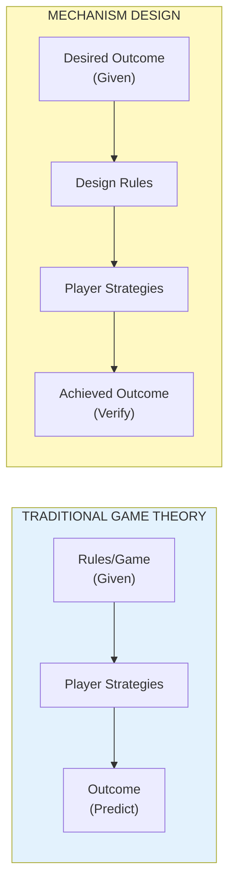
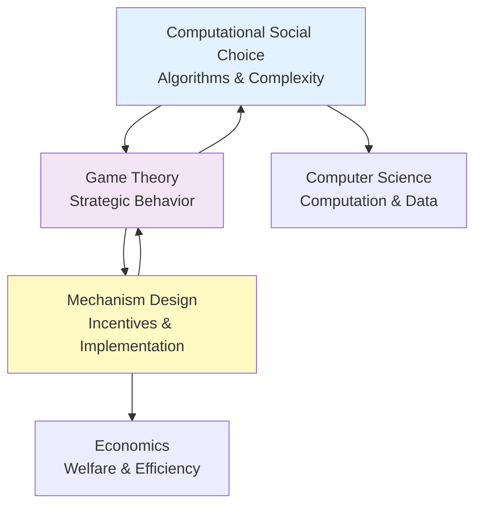

# Warden's Dilemma and Mechanism Design

**Last Updated**: January 2025

## Table of Contents

1. [What is Mechanism Design?](#what-is-mechanism-design)
2. [Why "Reverse Game Theory"?](#why-reverse-game-theory)
3. [How Warden's Dilemma Relates to Mechanism Design](#how-wardens-dilemma-relates-to-mechanism-design)
4. [Key Concepts](#key-concepts)
5. [Research Applications](#research-applications)
6. [Example Mechanisms in Warden's Dilemma](#example-mechanisms-in-wardens-dilemma)
7. [From Theory to Practice](#from-theory-to-practice)
8. [Further Reading](#further-reading)

---

## What is Mechanism Design?

**Mechanism design** is a field within economics and game theory that studies how to design rules, institutions, or "mechanisms" that produce desirable outcomes—even when participants have private information and may act strategically.

### The Core Problem

Traditional game theory asks:
> "Given a set of rules (a game), what will rational players do?"

Mechanism design **reverses** this question:
> "Given a desired outcome, what rules should we create to make rational players produce that outcome?"

This is why mechanism design is sometimes called **"reverse game theory"** or **"implementation theory"**.

### Classic Examples

1. **Auction Design**: How should we structure an auction so bidders reveal their true valuations and the item goes to whoever values it most?
   - Solution: Vickrey (second-price) auction

2. **Voting Systems**: How should we aggregate preferences so the outcome reflects collective will while discouraging strategic voting?
   - Challenge: Arrow's Impossibility Theorem shows no perfect system exists

3. **Kidney Exchange**: How should we match donors and recipients to maximize transplants?
   - Solution: Top Trading Cycles mechanism

4. **Internet Routing**: How should routers coordinate to maximize network efficiency when each is controlled by competing companies?
   - Solution: BGP protocol (imperfect but functional)

---

## Why "Reverse Game Theory"?



**Traditional Game Theory**: Start with rules → predict outcomes

**Mechanism Design**: Start with desired outcome → design rules to achieve it

### The Challenge

Players have:
- **Private information**: Their true preferences, costs, values
- **Strategic incentives**: To misrepresent information if beneficial
- **Rational behavior**: They'll exploit any weaknesses in the rules

The mechanism designer must create rules that work **despite** these challenges.

---

## How Warden's Dilemma Relates to Mechanism Design

Warden's Dilemma is a **mechanism design laboratory**. Here's the mapping:

| Mechanism Design Concept | Warden's Dilemma Implementation |
|--------------------------|----------------------------------|
| **Mechanism** | Payoff matrix + communication rules |
| **Agents** | Players (human or LLM) |
| **Type Space** | Player preferences, risk attitudes |
| **Action Space** | {Cooperate, Defect, Opt-Out} |
| **Outcome** | Score allocations, coalition patterns |
| **Social Choice Function** | What we want to observe (e.g., sustained cooperation) |
| **Designer** | Experimenter (the "Warden") |

### The Warden as Mechanism Designer

The experimenter's problem is a **mechanism design problem**:

**Goal**: Design a payoff matrix that produces interesting behavioral variation

**Constraints**:
- Players will act strategically
- Players can communicate privately (cheap talk)
- Players may form coalitions
- LLM agents may have unknown "preferences"

**Tools**:
- Payoff matrix structure (cooperate vs. defect rewards)
- Opt-out safety valve
- Communication phase duration
- Number of rounds (repeated game effects)

**Objective Function**: Maximize behavioral diversity and strategic depth while maintaining engagement

This is exactly the mechanism design paradigm: "What incentive structure achieves our research goals?"

---

## Key Concepts

### 1. Incentive Compatibility (IC)

A mechanism is **incentive-compatible** if telling the truth is the best strategy for every player.

**In Warden's Dilemma**:
- Players may **lie in chat**: "I'll cooperate" (then defect)
- Actions reveal true preferences: What they **do** vs. what they **say**
- We can measure: How often do promises align with actions?

**Research Question**: Under which payoff matrices do LLM agents exhibit truth-telling vs. deception?

### 2. Individual Rationality (IR)

A mechanism is **individually rational** if every player prefers to participate rather than opt-out.

**In Warden's Dilemma**:
- Opt-out provides a guaranteed payoff (typically small but positive)
- If payoffs are too adversarial, everyone opts out → game collapses
- The warden must balance: defection incentives vs. participation incentives

**Research Question**: What's the boundary where cooperation becomes impossible and everyone opts out?

### 3. Implementation Theory

Can a desired outcome be "implemented" (guaranteed in equilibrium) by some mechanism?

**In Warden's Dilemma**:
- Can we design a matrix that **guarantees** cooperation in Nash equilibrium?
- Can we design a matrix where defection is **strictly dominant**?
- Can we create a "knife's edge" where multiple equilibria exist?

**Research Question**: Which social choice functions can be implemented via payoff matrix design?

### 4. Revelation Principle

Any outcome achievable by a complex mechanism can also be achieved by a simple "direct revelation mechanism" where players report their types truthfully.

**In Warden's Dilemma**:
- Communication phase = "indirect mechanism" (players negotiate)
- Action phase = "direct mechanism" (players reveal their strategy)
- We can compare: Does communication improve outcomes? Or just enable deception?

**Research Question**: Does the communication phase lead to more cooperative outcomes, or just more sophisticated defection?

### 5. Dominant Strategy Incentive Compatibility (DSIC)

A mechanism is DSIC if truth-telling is optimal **regardless of what others do**.

**In Warden's Dilemma**:
- Defection is often a dominant strategy in one-shot prisoner's dilemma
- Repeated games change this (tit-for-tat becomes viable)
- Communication adds another layer (commitments, threats, coalitions)

**Research Question**: Can we identify matrices where cooperation is a dominant strategy?

---

## Research Applications

### 1. Empirical Mechanism Design

Traditional mechanism design is **theoretical**: prove properties mathematically.

Warden's Dilemma enables **empirical** mechanism design:
- Test candidate mechanisms with real players
- Measure actual behavior vs. theoretical predictions
- Iterate: refine the mechanism based on observed exploits

**Example Research Questions**:
- Does the VCG mechanism actually induce truth-telling in practice?
- How sensitive are cooperation rates to small payoff perturbations?
- Can humans detect and exploit suboptimal equilibria?

### 2. Behavioral Mechanism Design

Classical mechanism design assumes perfect rationality.

**Behavioral mechanism design** accounts for human biases:
- Loss aversion
- Fairness preferences
- Social norms
- Bounded rationality

**Warden's Dilemma Application**:
- Compare human vs. LLM agent behavior under identical mechanisms
- Test: Do humans cooperate more than game-theoretic predictions?
- Test: Do LLMs exhibit "social preferences" or pure payoff maximization?

### 3. AI Alignment and Specification Gaming

LLM agents are the **new frontier** for mechanism design:

**Challenges**:
- Unknown utility functions (what are LLM "preferences"?)
- Superhuman strategic reasoning (can they find exploits humans miss?)
- Coordination capabilities (can agents form tacit collusions?)

**Warden's Dilemma as a Test Bed**:
- Design mechanisms (payoff matrices) intended to align AI behavior
- Observe: Do agents find loopholes? (specification gaming)
- Observe: Do agents coordinate to exploit the mechanism?
- Observe: Can we detect deceptive alignment (cooperate initially, defect later)?

**Critical AI Safety Question**: "Can we design incentive structures that reliably align powerful AI systems?"

### 4. Coalition Formation and Stability

Mechanism design often ignores coalitions (assumes individual incentives).

Warden's Dilemma **explicitly enables** coalition formation:
- Players can negotiate in private 1:1 chats
- Coalitions can coordinate to exploit non-coalition members
- Mechanism designer must anticipate and prevent harmful coalitions

**Research Questions**:
- Under which payoff structures do coalitions form?
- How stable are coalitions across repeated rounds?
- Can the mechanism designer prevent "unfair" coalitions?

---

## Example Mechanisms in Warden's Dilemma

### Mechanism 1: Pure Prisoner's Dilemma

**Payoff Matrix** (3 players):
```
                0 others C   1 other C    2 others C
Cooperate          1            2             3
Defect             2            3             4
Opt-Out            0            0             0
```

**Properties**:
- Defection strictly dominates cooperation
- Nash equilibrium: (D, D, D) with payoff (2, 2, 2)
- Social optimum: (C, C, C) with payoff (3, 3, 3)
- Classic tension: individual vs. collective incentives

**Prediction**: Most players defect (especially LLMs trained on game theory)

**Use Case**: Baseline for measuring cooperation rates

---

### Mechanism 2: Coordination Game

**Payoff Matrix** (3 players):
```
                0 others C   1 other C    2 others C
Cooperate          0            3             5
Defect             1            1             1
Opt-Out            0            0             0
```

**Properties**:
- Cooperation payoff increases with more cooperators
- Multiple equilibria: (C, C, C) and (D, D, D)
- Communication can help coordinate to high-payoff equilibrium

**Prediction**: Communication phase becomes critical for coordination

**Use Case**: Study role of communication in equilibrium selection

---

### Mechanism 3: Public Goods Game

**Payoff Matrix** (3 players):
```
                0 others C   1 other C    2 others C
Cooperate          0            1             2
Defect             1            2             3
Opt-Out            0.5          0.5           0.5
```

**Properties**:
- Free-rider problem: defection gives +1 bonus
- Cooperation benefits everyone, including defectors
- Opt-out provides safety but low payoff

**Prediction**: Defection increases over rounds as trust erodes

**Use Case**: Study decay of cooperation in public goods provision

---

### Mechanism 4: Assurance Game (Stag Hunt)

**Payoff Matrix** (3 players):
```
                0 others C   1 other C    2 others C
Cooperate          0            2             5
Defect             2            2             2
Opt-Out            1            1             1
```

**Properties**:
- Cooperation is risky: high reward if others cooperate, zero if they don't
- Defection is safe: guaranteed 2
- Opt-out is safer: guaranteed 1

**Prediction**: Communication increases cooperation (reduces coordination risk)

**Use Case**: Study role of trust and risk in cooperation

---

## From Theory to Practice

### How to Use Warden's Dilemma for Mechanism Design Research

#### Step 1: Define Your Objective

What outcome do you want to study?
- Sustained cooperation?
- Coalition stability?
- Deception detection?
- Specification gaming by LLMs?

#### Step 2: Design Candidate Mechanisms

Create several payoff matrices that theoretically should produce different behaviors:
- Matrix A: Cooperation dominant
- Matrix B: Defection dominant
- Matrix C: Multiple equilibria
- Matrix D: Asymmetric roles

#### Step 3: Run Experiments

- Deploy each matrix with 3-4 players
- Run 10+ rounds per experiment
- Collect data: actions, chat logs, scores

#### Step 4: Analyze Results

Compare **predicted** vs. **observed** behavior:
- Did cooperation rates match theoretical predictions?
- Which equilibrium was selected?
- Did coalitions form as expected?
- Were there unexpected exploits?

#### Step 5: Iterate

Refine the mechanism:
- Patch discovered exploits
- Adjust payoffs to shift incentives
- Test with different player types (human vs. LLM)

This is **empirical mechanism design**: iterative refinement based on real behavior.

---

## Warden's Dilemma as a Meta-Mechanism

There's a deeper connection: Warden's Dilemma is a **meta-mechanism** for discovering good mechanisms.

```
Level 1: The Game (Prisoner's Dilemma)
  ↓
Level 2: The Mechanism (Payoff Matrix Choice)
  ↓
Level 3: The Meta-Mechanism (Platform for Testing Mechanisms)
```

**The Platform's Value**:
- Lets experimenters **rapidly test** mechanism designs
- Provides **real behavioral data** (not just proofs)
- Enables **human-LLM comparison** under identical conditions
- Supports **iterative refinement** of mechanisms

This is mechanism design for **mechanism designers**.

---

## Connection to Social Choice Theory

**Social Choice Theory** asks: "How do we aggregate individual preferences into collective decisions?"

**Classic Problems**:
- Voting systems (Arrow's Impossibility Theorem)
- Fair division
- Preference aggregation

**Warden's Dilemma Application**:

In a game with N players, the **social choice function** might be:
- Maximize total welfare (sum of payoffs)
- Maximize minimum payoff (maximin / Rawlsian)
- Achieve Pareto efficiency
- Ensure fairness (equal payoffs)

**The Warden's Problem**: Design a payoff matrix that **implements** the desired social choice function.

**Example**: Can we design a matrix where:
- The Nash equilibrium is Pareto-efficient?
- Players voluntarily achieve the social optimum?
- No player is strictly worse off than opting out?

This is a **mechanism design question** grounded in **social choice theory**.

---

## Computational Social Choice

**Computational Social Choice (COMSOC)** is an interdisciplinary field combining:
- Computer Science (algorithms, complexity theory)
- Economics (social choice theory, game theory)
- Political Science (voting systems, collective decision-making)

### What is Computational Social Choice?

COMSOC studies the **computational aspects** of collective decision-making:
- **Complexity**: How hard is it to compute the winner of an election?
- **Algorithms**: What efficient algorithms exist for preference aggregation?
- **Manipulation**: Can strategic voters manipulate voting outcomes? How hard is it?
- **Communication**: How much information must be exchanged to reach a decision?

### Key Problems in COMSOC

#### 1. Winner Determination

**Problem**: Given N voters' preferences over M candidates, compute the winning candidate(s) under a given voting rule.

**Complexity Results**:
- Simple rules (Plurality, Borda): Polynomial time (O(NM))
- Kemeny rule (minimize pairwise disagreements): NP-hard
- Dodgson rule (minimum edits to make Condorcet winner): Θ_2^p-complete

**Warden's Dilemma Analog**:
- N players' actions → aggregate outcome (total cooperation, coalition structure)
- Computing Nash equilibria in general games: PPAD-complete
- Our platform makes this **tractable** through simulation and empirical observation

#### 2. Strategic Manipulation

**Problem**: Can a voter benefit by lying about their preferences?

**Gibbard-Satterthwaite Theorem**: Every non-dictatorial voting rule with ≥3 candidates is manipulable.

**Warden's Dilemma Analog**:
- Players can "lie" during communication phase: promise cooperation, then defect
- **Research Question**: How hard is it for LLM agents to discover and execute manipulation strategies?
- **Platform Feature**: We can measure manipulation frequency empirically

#### 3. Coalitional Manipulation

**Problem**: Can a group of voters coordinate to change the outcome?

**Complexity**:
- For many voting rules, finding beneficial coalitions is NP-hard
- But approximation algorithms exist
- Heuristic strategies often work in practice

**Warden's Dilemma Implementation**:
- Players explicitly form coalitions via private chat
- **Research Question**: How do computational constraints affect coalition formation?
- **Observation**: Can LLMs solve the coalition coordination problem efficiently?

#### 4. Communication Complexity

**Problem**: How many bits must be exchanged to compute a social choice function?

**Classic Result**: Even for simple rules, communication complexity can be exponential in the number of voters.

**Warden's Dilemma Context**:
- Communication phase has finite duration → bounded message complexity
- **Research Question**: Is the 60-second communication window sufficient for players to coordinate?
- **Extension**: Vary communication duration and measure effect on cooperation rates

### COMSOC Meets Mechanism Design

Computational Social Choice and Mechanism Design are deeply connected:



**Synergy**:
- Mechanism Design asks: "What rules should we use?"
- COMSOC asks: "How do we efficiently compute outcomes under those rules?"

### Warden's Dilemma as a COMSOC Platform

#### Application 1: Voting on Payoff Matrices

**Scenario**: Before the game starts, players **vote** on which payoff matrix to use.

**COMSOC Questions**:
- Which voting rule should be used? (Plurality? Borda count? Approval voting?)
- Can strategic players manipulate the vote to their advantage?
- How does computational complexity affect real-time voting?

**Implementation**:
- Add a pre-game phase where players rank payoff matrices
- Experimenter selects voting rule
- Measure: Do players vote honestly? Or strategically?

#### Application 2: Coalition Structure Computation

**Scenario**: Analyze post-game data to identify coalition structures.

**COMSOC Questions**:
- Which players communicated most frequently?
- Can we detect coordinated actions (e.g., simultaneous cooperation)?
- What's the computational complexity of coalition detection in our setting?

**Implementation**:
- Graph analysis of communication patterns
- Clustering algorithms to identify coalitions
- Compare detected coalitions to observed action coordination

#### Application 3: Preference Elicitation

**Scenario**: Instead of observing actions, ask players to **rank** possible outcomes.

**COMSOC Questions**:
- How many queries are needed to determine full preference orderings?
- Can we use active learning to minimize queries?
- Do revealed preferences match stated preferences?

**Implementation**:
- Add survey questions between rounds
- Compare: stated preferences vs. actions taken
- Measure: consistency of preferences across rounds

#### Application 4: Fairness and Welfare Computation

**Scenario**: Post-game analysis of outcome fairness.

**COMSOC Metrics**:
- **Utilitarian welfare**: Sum of all payoffs (is it maximized?)
- **Egalitarian welfare**: Minimum payoff (maximin - is it maximized?)
- **Envy-freeness**: Does any player prefer another's payoff?
- **Proportionality**: Does each player get at least their "fair share"?

**Warden's Dilemma Analysis**:
- Compute these metrics for each payoff matrix
- Compare: Which mechanism achieves the best welfare/fairness tradeoff?
- **Research Question**: Do mechanisms that score well in theory also score well empirically?

### Algorithms for Warden's Dilemma

#### Algorithm 1: Nash Equilibrium Finder

**Input**: Payoff matrix, number of players
**Output**: All pure strategy Nash equilibria

**Complexity**:
- General case: PPAD-complete
- Our specific case (symmetric games): Polynomial in many cases
- Empirical approach: Enumerate and check (feasible for N ≤ 10 players)

**Usage**: Predict which equilibria players will converge to

#### Algorithm 2: Coalition Detection

**Input**: Chat logs, action history
**Output**: Detected coalitions with confidence scores

**Approach**:
1. Build communication graph (edges = messages)
2. Detect communities (Louvain algorithm)
3. Check for correlated actions (mutual cooperation/defection)
4. Compute coalition stability score

**Complexity**: O(N² log N) for N players, T rounds

**Usage**: Identify which players are coordinating

#### Algorithm 3: Strategic Manipulation Detector

**Input**: Chat logs, promised actions, actual actions
**Output**: Manipulation events (lies detected)

**Approach**:
1. Parse chat for commitment statements ("I will cooperate")
2. Extract promised action from language
3. Compare promised action to actual action
4. Classify: honest, white lie, strategic lie, confused

**Complexity**: O(M log M) for M messages (NLP parsing dominates)

**Usage**: Measure deception rates across different mechanisms

#### Algorithm 4: Payoff Matrix Optimizer

**Input**: Desired properties (e.g., "maximize cooperation rate")
**Output**: Optimized payoff matrix

**Approach**:
1. Define objective function: f(matrix) = cooperation_rate
2. Use Bayesian Optimization or RL to search matrix space
3. Evaluate each candidate matrix via simulation (agents play N rounds)
4. Return best-performing matrix

**Complexity**: Requires many simulations (expensive), but parallelizable

**Usage**: Automatically discover interesting mechanisms

### Impossibility Results and Warden's Dilemma

Several **impossibility theorems** from social choice theory apply to Warden's Dilemma:

#### Arrow's Impossibility Theorem

**Statement**: No ranked-choice voting system can satisfy all of:
1. Unrestricted domain (any preferences allowed)
2. Non-dictatorship (no single voter decides)
3. Pareto efficiency (unanimous preferences respected)
4. Independence of Irrelevant Alternatives (IIA)

**Warden's Dilemma Analog**:
If players vote on payoff matrices, **no voting system** can satisfy all desirable properties.

**Implication**: The experimenter must make tradeoffs when aggregating player preferences.

#### Gibbard-Satterthwaite Theorem

**Statement**: Every non-dictatorial voting rule is manipulable (unless only 2 candidates).

**Warden's Dilemma Analog**:
Any mechanism that lets players influence the payoff matrix is **manipulable**.

**Implication**: Players will strategically vote for matrices that benefit them, not the group.

#### Revelation Principle (Mechanism Design)

**Statement**: Any implementable social choice function can be implemented by a truthful direct mechanism.

**Warden's Dilemma Analog**:
Any outcome achievable with strategic communication can also be achieved by a mechanism where players directly report their types.

**Implication**: The communication phase is technically "unnecessary"—but studying it reveals strategic communication patterns.

### Open Research Questions in COMSOC + Warden's Dilemma

1. **Manipulation Complexity for LLMs**: How computationally difficult is it for LLM agents to find manipulation strategies? Does scale (model size) improve manipulation ability?

2. **Communication vs. Computation**: Is the communication phase a bottleneck? Would more time → more cooperation? Or do players reach computational limits?

3. **Learning in Repeated Games**: Do LLM agents "learn" optimal strategies across rounds? Can we detect learning curves?

4. **Coalition Stability**: Under which mechanisms are coalitions stable across rounds? What causes them to dissolve?

5. **Fairness-Efficiency Tradeoff**: Can we design mechanisms that are both Pareto-efficient and envy-free? Or must we choose one?

6. **Mechanism Robustness**: How sensitive are cooperation rates to small payoff perturbations? Can we find "robust" mechanisms?

7. **Multi-Agent Alignment**: Can we design mechanisms where groups of AI agents align with human preferences? Or do AI coalitions always defect against humans?

---

## COMSOC Resources for Warden's Dilemma Researchers

### Books

1. **Felix Brandt et al. (2016)**: "Handbook of Computational Social Choice"
   - Comprehensive reference covering voting, matching, fair division

2. **Yoav Shoham & Kevin Leyton-Brown (2009)**: "Multiagent Systems: Algorithmic, Game-Theoretic, and Logical Foundations"
   - Textbook with sections on mechanism design and computational complexity

### Papers

3. **Vincent Conitzer (2010)**: "Making Decisions Based on the Preferences of Multiple Agents"
   - Tutorial on COMSOC basics

4. **Ariel Procaccia (2013)**: "Can Approximation Circumvent Gibbard-Satterthwaite?"
   - Explores whether approximate voting rules avoid manipulation

5. **Piotr Faliszewski et al. (2021)**: "Strategic Behavior in Multi-Agent Systems"
   - Survey of manipulation, control, and bribery in voting

### Online Courses

- **Stanford CS 269I**: "Incentives in Computer Science" (Tim Roughgarden)
- **Harvard CS 136**: "Economics and Computation" (David Parkes)
- **Coursera**: "Game Theory" (Matthew Jackson, Kevin Leyton-Brown)

### Conferences

- **COMSOC Workshop**: Biennial workshop on computational social choice
- **AAMAS**: Autonomous Agents and Multiagent Systems
- **EC (Economics and Computation)**: ACM conference on computational economics
- **WINE**: Workshop on Internet and Network Economics

---

## Limitations and Challenges

### 1. Bounded Rationality

Real players are not perfectly rational:
- They make mistakes
- They have limited computational resources
- They exhibit biases (loss aversion, fairness preferences)

**Implication**: Mechanisms that work in theory may fail with real players.

### 2. Unknown Type Spaces

With LLM agents, we don't know their true "preferences":
- Are they reward maximizers?
- Do they have social preferences?
- Are they following instructions literally?

**Implication**: Hard to design incentive-compatible mechanisms for unknown utility functions.

### 3. Computational Complexity

Finding optimal mechanisms is often NP-hard:
- Exhaustive search over payoff matrices is intractable
- Equilibrium analysis becomes complex with communication

**Implication**: We rely on heuristics and empirical testing, not provably optimal designs.

### 4. External Validity

Lab experiments may not generalize to real-world settings:
- Stakes are lower (play money, not real money)
- Participants are WEIRD (Western, Educated, Industrialized, Rich, Democratic)
- Time horizons are short

**Implication**: Results are suggestive, not definitive.

---

## Future Directions

### 1. Automated Mechanism Design

Use machine learning to **automatically discover** good mechanisms:
- Define objective: e.g., "maximize cooperation rate"
- Search over payoff matrix space using RL or genetic algorithms
- Warden's Dilemma provides the evaluation function

**Potential**: Discover mechanisms humans wouldn't think of.

### 2. Mechanism Design for AI Alignment

Design incentive structures that:
- Prevent specification gaming
- Detect deceptive alignment
- Encourage honest reporting by AI systems

**Warden's Dilemma as a Sandbox**: Test alignment mechanisms before deploying on powerful AI.

### 3. Dynamic Mechanisms

Current implementation: static payoff matrix per round.

**Extension**: Allow the mechanism to adapt based on history:
- If cooperation rate drops, increase cooperation bonus
- If coalitions form, introduce asymmetric payoffs
- If agents exploit, patch the mechanism mid-game

This is **adaptive mechanism design**.

### 4. Multi-Stage Mechanisms

Extend beyond the 4-phase loop:
- Pre-game negotiation (players vote on the payoff matrix)
- Mid-game interventions (experimenter adjusts rules)
- Post-game reputation (players' strategies affect future matches)

This enables richer mechanism design experiments.

---

## Further Reading

### Classic Papers

1. **Leonid Hurwicz (1960)**: "Optimality and Informational Efficiency in Resource Allocation Processes"
   - Foundational work defining mechanism design

2. **Roger Myerson (1981)**: "Optimal Auction Design"
   - Revenue equivalence theorem and optimal auctions

3. **Eric Maskin (1999)**: "Nash Equilibrium and Welfare Optimality"
   - Implementation theory and necessity theorems

4. **Alvin Roth & Lloyd Shapley (2012)**: Nobel Prize for "Stable Allocations"
   - Matching markets and mechanism design applications

### Modern Resources

5. **Tim Roughgarden (2016)**: "Twenty Lectures on Algorithmic Game Theory"
   - Computational perspective on mechanism design

6. **Noam Nisan et al. (2007)**: "Algorithmic Game Theory"
   - Comprehensive textbook with implementation focus

7. **Matthew Jackson (2014)**: "Mechanism Theory" (Stanford lecture notes)
   - Accessible introduction with examples

### Related to AI

8. **Vincent Conitzer et al. (2022)**: "Mechanism Design for LLMs"
   - Emerging field of AI alignment via mechanism design

9. **Dylan Hadfield-Menell et al. (2016)**: "Cooperative Inverse Reinforcement Learning"
   - Mechanism design perspective on AI alignment

### Online Resources

- **Wikipedia**: [Mechanism Design](https://en.wikipedia.org/wiki/Mechanism_design)
- **Wikipedia**: [Revelation Principle](https://en.wikipedia.org/wiki/Revelation_principle)
- **Wikipedia**: [VCG Mechanism](https://en.wikipedia.org/wiki/Vickrey%E2%80%93Clarke%E2%80%93Groves_mechanism)
- **Stanford Encyclopedia of Philosophy**: [Social Choice Theory](https://plato.stanford.edu/entries/social-choice/)

---

## Summary

**Warden's Dilemma is a mechanism design laboratory** where:

1. **The Designer** (Experimenter/Warden) creates rules (payoff matrices)
2. **The Agents** (Players/LLMs) respond strategically
3. **The Outcome** reveals whether the mechanism achieved its goals
4. **The Iteration** refines the mechanism based on observed behavior

This platform enables:
- **Empirical testing** of mechanism design theories
- **Comparative analysis** of human vs. LLM strategic behavior
- **Discovery** of novel mechanisms through experimentation
- **AI safety research** via specification gaming detection

The connection to mechanism design is fundamental: the experimenter's challenge—"Which payoff matrix is interesting?"—is precisely the mechanism designer's challenge: "Which rules achieve the desired outcome?"

By framing Warden's Dilemma through the lens of mechanism design, we connect game research to decades of economic theory and position the platform as a tool for advancing both mechanism design and AI alignment research.

---

**For questions or discussion about mechanism design and Warden's Dilemma, please open an issue on GitHub.**
